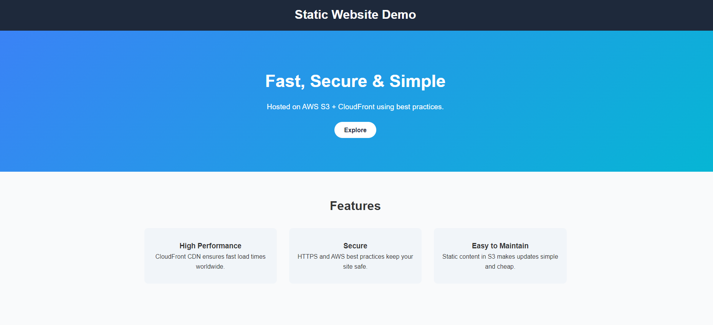
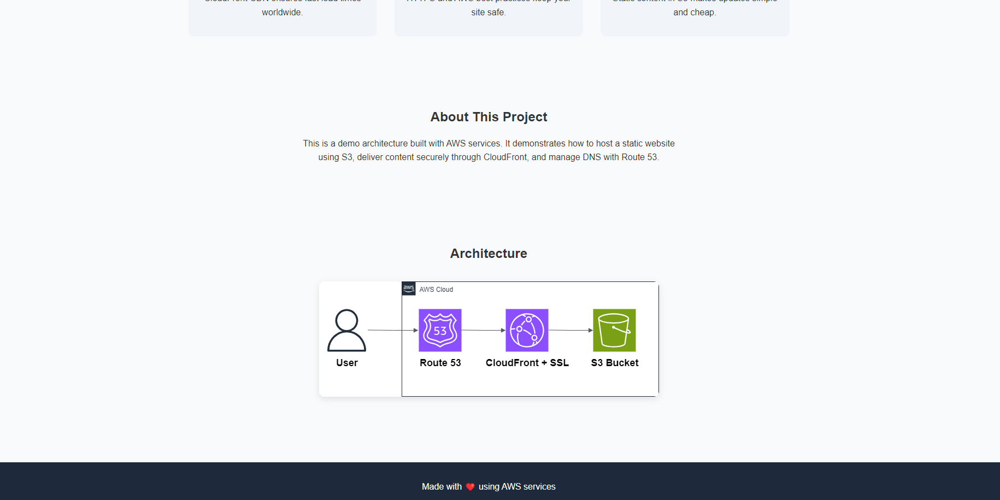

# 01 — Static Website Hosting

This example shows how to host a static website on AWS.  
The site is stored in **Amazon S3** and delivered with **Amazon CloudFront** for speed and security.

---

## Architecture


**Main services:**

- **S3** → keeps the website files (HTML, CSS, images).
- **CloudFront** → makes the site faster worldwide and adds HTTPS.
- **ACM** → SSL certificate for HTTPS.
- **Route 53** → optional, to use your own domain.

---

## Why this pattern?

- Simple way to publish a website.
- Very low cost and easy to manage.
- Works for portfolios, landing pages, or company sites.

---

## What’s inside

- Architecture diagram
- Terraform code for S3, CloudFront, ACM, and Route 53
- Example static website with logo
- Deployment scripts

---

## Demo Screenshots

Here are a couple of screenshots showing the deployed website:

  


---

## Step-by-Step Deployment Guide

```bash
# 1. Configure Terraform variables
# Edit terraform.tfvars with your project details
# project_name   = "YOUR_PROJECT_NAME"
# domain_name    = "YOUR_DOMAIN_NAME"
# hosted_zone_id = "YOUR_HOSTED_ZONE_ID"

# 2. Deploy the infrastructure
cd scripts
./deploy.sh

# 3. Verify your website

# 4. Destroy the infrastructure (optional)
cd scripts
./destroy.sh
```
