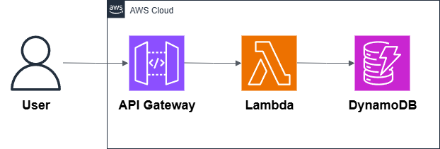
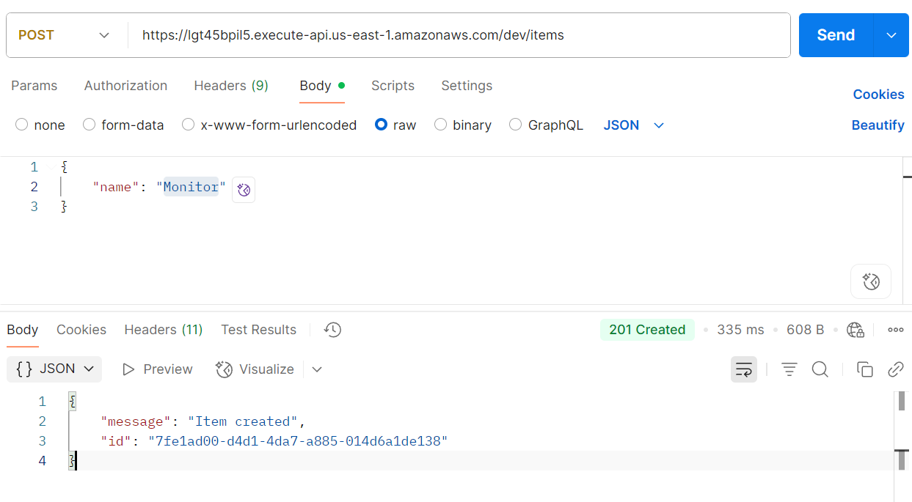
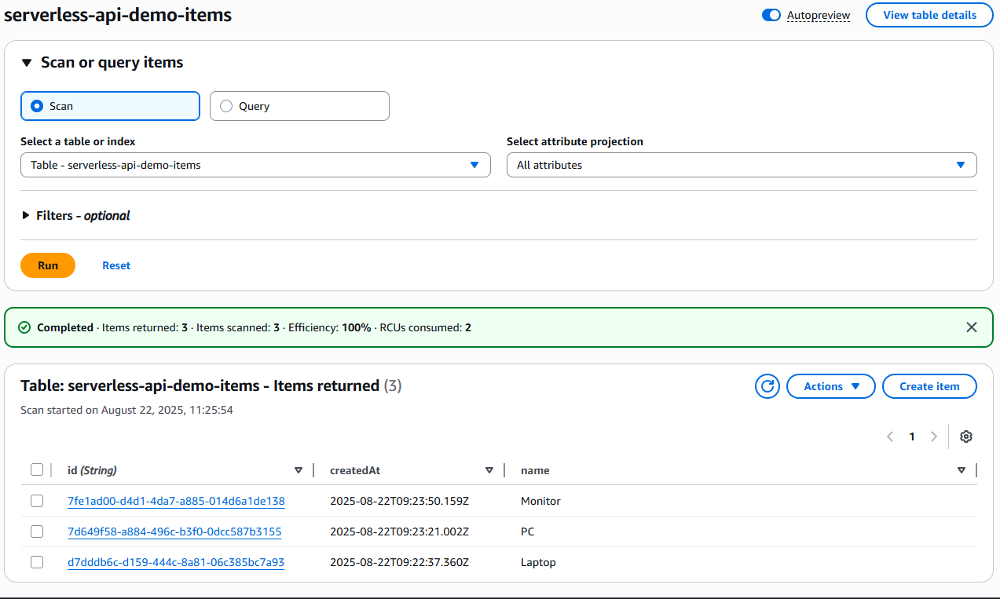
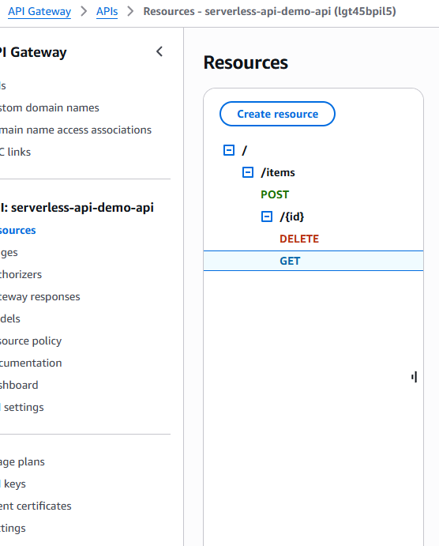

# 02 — Serverless API Backend

This example shows how to build a serverless API on AWS.  
It uses **API Gateway**, **Lambda**, and **DynamoDB** to create a backend without managing servers.

---

## Architecture

**Main services:**

- **API Gateway** → entry point for the API (HTTPS endpoint).
- **Lambda (Node.js)** → serverless functions that process requests.
- **DynamoDB** → NoSQL database to store items.

---

## Why this pattern?

- Fully managed (no servers to maintain).
- Scales automatically.
- Pay only for what you use.
- Perfect for small apps, prototypes, and production APIs.

---

## What’s inside

- Architecture diagram
- Terraform code for API Gateway, Lambda, and DynamoDB
- Example Lambda function (Node.js)
- Deployment scripts

---

## Demo Screenshots

Here are a couple of screenshots showing the deployed backend:

  

