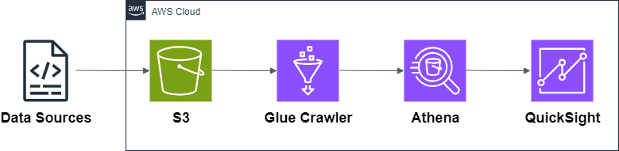

# 03 — Data Lake on AWS

This example shows how to build a simple **Data Lake** on AWS.  
It uses **Amazon S3**, **AWS Glue**, **Amazon Athena**, and **Amazon QuickSight** to store, process, and analyze data without managing servers.

---

## Architecture

**Main services:**

- **S3** → central storage for raw and processed data.
- **Glue** → crawler + ETL jobs to catalog and transform data.
- **Athena** → query data directly from S3 using SQL.
- **QuickSight** → dashboards and visualizations.

---

## Why this pattern?

- Central place to store structured & unstructured data.
- Serverless (no infrastructure to manage).
- Scalable and cost-effective.
- Enables analytics and BI with SQL and dashboards.

---

## What’s inside

- Architecture diagram
- Terraform code for S3, Glue, Athena, and IAM roles
- Example datasets for ingestion
- Deployment scripts
