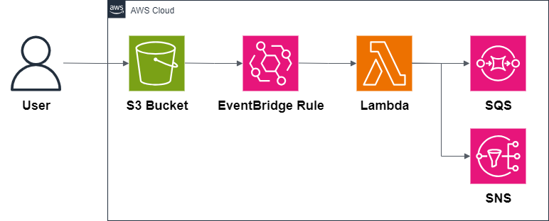
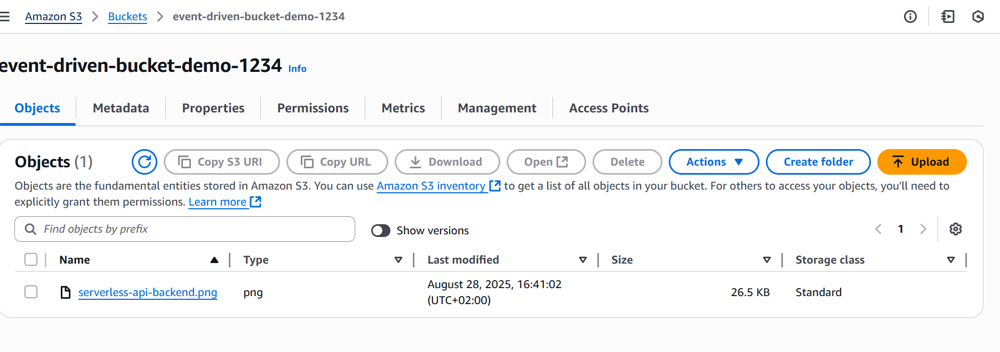
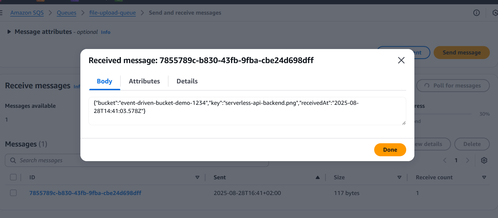
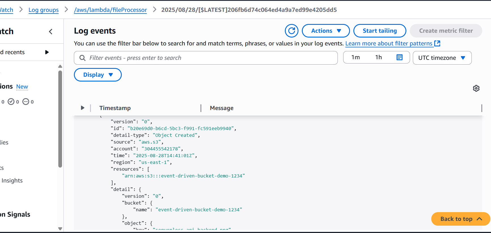
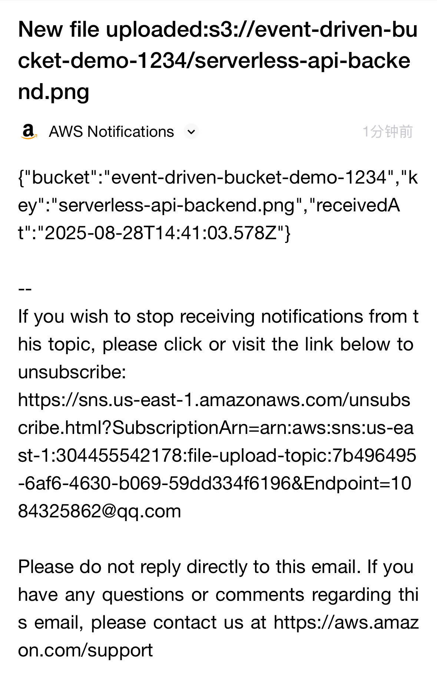

# 04 — Event-Driven Processing on AWS

This example shows how to build an **event-driven architecture** on AWS.  
It uses **Amazon S3**, **Amazon EventBridge**, **AWS Lambda**, **Amazon SNS**, and **Amazon SQS** to process events asynchronously and deliver notifications.

---

## Architecture

**Main services:**

- **S3** → stores uploaded files that trigger events.
- **EventBridge** → routes S3 events to downstream services.
- **Lambda** → processes the file and publishes notifications.
- **SNS** → sends notifications to subscribers (email, SMS, HTTP, etc.).
- **SQS** → stores events for asynchronous processing or retries.

---

## Why this pattern?

- **Asynchronous** → decouples ingestion from processing.
- **Scalable** → handles high volumes of events.
- **Reliable** → ensures messages are not lost (with SQS).
- **Extensible** → new consumers can be added without changing producers.

---

## What’s inside

- Architecture diagram
- Terraform code for S3, EventBridge, Lambda, SNS, and SQS
- Example Node.js Lambda for file processing
- Deployment scripts

---

## Demo Screenshots

Here are a couple of screenshots showing the deployed event driven:

  

