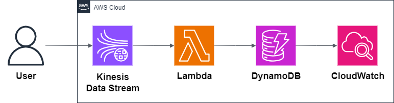

# 05 — Real-Time Data Streaming on AWS

This example demonstrates a **real-time data streaming pattern** on AWS.  
It uses **Amazon Kinesis Data Streams**, **AWS Lambda**, and **Amazon DynamoDB** to ingest, process, and store streaming data with a serverless architecture.

---

## Architecture

**Main services:**

- **Kinesis Data Streams** → capture real-time events (e.g., IoT data, app logs, clickstream).
- **Lambda** → process Kinesis records and apply business logic.
- **DynamoDB** → store processed data for fast queries.
- **CloudWatch** → monitoring and logging.

---

## Why this pattern?

- Real-time ingestion and processing of high-velocity data.
- Fully serverless (scales with demand).
- Low-latency and cost-effective.
- Ideal for IoT, analytics, monitoring pipelines, or real-time dashboards.

---

## What’s inside

- Architecture diagram
- Terraform code for:
  - Kinesis Data Stream
  - Lambda with IAM permissions
  - DynamoDB table
- Node.js Lambda function
