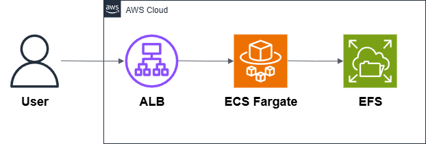

# 06 — Containerized Web App

This example shows how to run a **containerized web application** on AWS.  
It uses **ECS Fargate**, **Application Load Balancer (ALB)**, and **EFS** for persistent storage.

---

## Architecture

**Main services:**

- **ECS Fargate** → runs containers without managing servers.
- **ALB (Application Load Balancer)** → routes HTTP traffic to ECS tasks.
- **EFS (Elastic File System)** → shared, persistent storage across tasks.

---

## Why this pattern?

- Fully managed containers with no servers to patch.
- Horizontal scaling with ALB + ECS service.
- Persistent shared storage with EFS (files survive even if tasks restart).
- Good fit for web apps, CMS, or any app that needs shared state.

---

## What’s inside

- Terraform code for ECS cluster, task definition, service, and ALB.
- EFS with access point mounted into containers.
- Bootstrap container that seeds a default `index.html` into EFS.
- Architecture diagram and deployment scripts.
