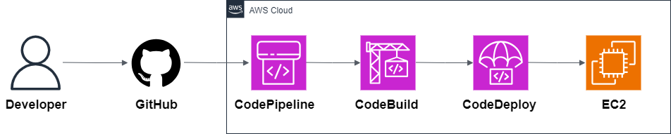

# 07 — CI/CD Pipeline on AWS

This example shows how to build a **CI/CD pipeline** on AWS.  
It uses **AWS CodePipeline**, **AWS CodeBuild**, and **AWS CodeDeploy** to build, test, and deploy a simple Node.js application using Infrastructure-as-Code.

---

## Architecture

**Main services:**

- **CodeCommit / GitHub** → Source repository (this example assumes GitHub but CodeCommit is interchangeable).
- **CodePipeline** → Orchestrates the pipeline stages (Source → Build → Deploy).
- **CodeBuild** → Builds & tests the application; produces artifacts.
- **CodeDeploy** → Deploys artifacts to compute targets (Lambda).
- **IAM** → Roles and policies for each service to operate with least privilege.

---

## Why this pattern?

- **Automated delivery** → Every commit can trigger build & deploy.
- **Repeatable & auditable** → Pipeline records history and artifacts.
- **Extensible** → Add test stages, security scans, approvals.
- **Serverless-first / managed services** → Low ops overhead using AWS managed CI/CD.

---

## What’s inside

- Architecture diagram
- Terraform code to provision: IAM roles, CodeBuild project, CodeDeploy application + deployment group, CodePipeline connected to GitHub.
- `buildspec.yml` for build steps and artifact packaging.
- `appspec.yml` and hooks for CodeDeploy.
- Example Node.js app with simple endpoint.
- Deployment scripts and README for running locally and deploying.
