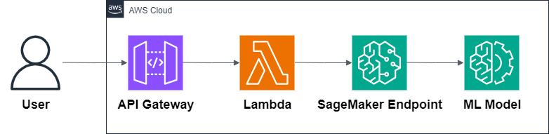

# 09 — Machine Learning Model Deployment

This example shows how to deploy a machine learning model using AWS serverless services.  
It uses **API Gateway**, **Lambda**, and **SageMaker** to create a scalable ML inference endpoint without managing servers.

---

## Architecture

---

## Main services

- **API Gateway** → entry point for inference requests (HTTPS endpoint).
- **Lambda (Node.js)** → serverless function that processes requests and calls SageMaker.
- **SageMaker** → managed ML service for model hosting and inference.
- **S3** → storage for model artifacts.

---

## Why this pattern?

- Fully managed (no servers to maintain).
- Scales automatically.
- Pay only for what you use.
- Perfect for ML prototypes and production inference endpoints.

---

## What’s inside

- Architecture diagram
- Terraform code for API Gateway, Lambda, SageMaker, and S3
- Example Lambda function (Node.js)
- Model training script (Python)
- Deployment scripts
